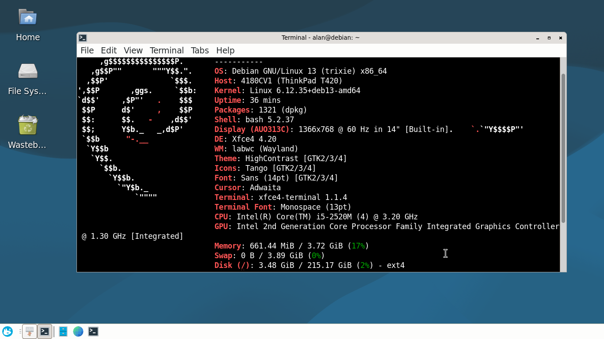
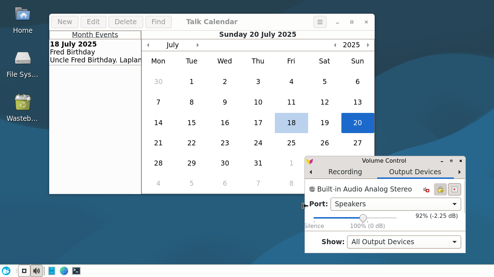

# Xfce4 Wayland 

## Set Up & Testing Using Debian 13 Trixie

Xfce is a lightweight desktop environment and version 4.20 is in the Debian 13 Trixie package repositories. This github page shows how it can be setup using the labwc Wayland compositor.

A screenshot of Xfce 4.20 Wayland is shown below. 



Notice that the Window Manager (WM) is the Wayland compositor called labwc and Xfce 4.20 is being used.

## Install Debian 13 Trixie

Install Debian Trixie (testing) with no desktop just the standard utilities using the net installer. The iso called ***debian-testing-amd64-netinst.iso*** can be downloaded from the web page below.

```
https://cdimage.debian.org/cdimage/daily-builds/daily/arch-latest/amd64/iso-cd/
```

When installing skip the root password section so that you are automatically added to the sudo group. Otherwise add yourself to the sudo group using the add user command. With a minimum install Debian 13 boots to a console terminal (tty1 by default). Here tty is short for teletype now more commonly called a terminal.

## Console Font Size

Log into the console terminal and increase font size by editing the console-setup file to that shown below. 

```
sudo nano /etc/default/console-setup
```

```
CHARMAP="UTF-8"
CODESET="Lat7"
FONTFACE="Terminus"
FONTSIZE="28x14"
```

Then reboot
```
sudo reboot
```

## Install Xfce and Wayland

Install Xfce and the Wayland compositor called labwc. [Labwc](https://github.com/labwc/labwc) stands for Lab Wayland Compositor. It is a [wlroots](https://gitlab.freedesktop.org/wlroots) based window stacking compositor for Wayland inspired by [Openbox](https://openbox.org/).  To install Xfce4 and labwc use the terminal commands below.

```
sudo apt install xfce4
sudo apt install labwc
sudo apt install xfce4-goodies
```


The [Xfce Wayland roadmap](https://wiki.xfce.org/releng/wayland_roadmap)  reveals that Xfce 4.20 provides preliminary Wayland support to core components. Various websites discuss using the following Sway components for added functionality.

* swayidle: Wayland idle management daemon 
* swaylock: Wayland screen locking utility 
* swaybg: Wayland wallpaper utility

These are installed using the commands below. 

```
sudo apt install swayidle
sudo apt install swaylock
sudo apt install swaybg
```

Reboot using 
```
sudo reboot
```

## Circumventing LightDM 

By default the LightDM display manager is invoked to start Xfce in an X11 session. Log-in using your username and password and open a terminal. Run the command below to get Debian to always boot to console mode.

```
sudo systemctl set-default multi-user.target
```

Reboot again and Debian boots to console mode.

Now check that a Xfce4 Wayland session can be started using the command below.

```
startxfce4 --wayland
```

You should see a very basic Xfce Wayland session with no wallpaper just a black background.

Note if you want to undo this change and get your Linux system to boot to the default graphical mode use the terminal command below.
```
sudo systemctl set-default graphical.target
```

## Boot to Wayland Session Automatically on Log-in

Use the command "ls -a" to list hidden files in the home directory. This reveals the hidden .profile file. Add the following code lines to the bottom of the profile file so that when you log into Debian via the console a Wayland Xfce session is automatically invoked.

```
case "`tty`" in
(/dev/tty[1-4]) exec startxfce4 --wayland
esac
```

Reboot and log in via the console using your password and an Xfce Wayland session will be automatically started.

## Setup Wayland Environment

Open the labwc environment file using nano as shown below.

```
nano ./config/xfce4/labwc/environment
```

Set the default keyboard. In my case the default is set to the GB keyboard as shown below.

```
XKB_DEFAULT_LAYOUT=gb
```

Restart labwc
```
labwc -r
```

Before rebooting create an empty file using the Mousepad text editor and save it as "lock" into the ./config/xfce4/labwc/ directory. This prevents Xfce automatically generating an fresh default environment file when it starts. 

Now reboot and check your keyboard.

## Sway Utilities

Sway is a tiling window manager and Wayland compositor. It is designed to be a drop-in replacement for the i3 X11 window manager. 

Various websites report that some Sway utilities can be used with a Xfce Wayland session. For example the Sway background utility called swaybg can be used to display a wallpaper.

Running the following command in a terminal uses swaybg to display the default Xfce wallpaper background.

```
swaybg -i /usr/share/desktop-base/active-theme/wallpaper/contents/images/1920x1080.svg
```

You can created a startup script in the home directory to set the wallpaper. The script is shown below. You need to make sure that you put an "&" at the end of the swaybg command to make it run in the background.

```
#!/bin/bash
echo "startup script"
swaybg -i /usr/share/desktop-base/active-theme/wallpaper/contents/images/1920x1080.svg &
```

The chmod command can be used to make the startup script executable.

```
chmod +x startup.sh
```

Running the startup script results in the default Wallpaper being displayed.

```
./startup.sh
```

The startup script can be added to the "Application Autostart" list in the [Session and Startup](https://docs.xfce.org/xfce/xfce4-session/4.20/preferences?s[]=autostart) preferences window so that the default wallpaper is loaded when the computer is restarted.

It seems that with Xfce startup entries are populated from:

~/.config/autostart (user-specific)

and

/etc/xdg/autostart/ (system-wide)

When I added the script I noticed that Xfce added a startup desktop file to the local ***~/.config/autostart*** directory and ran this after it had set up the system.

```
[Desktop Entry]
Encoding=UTF-8
Version=0.9.4
Type=Application
Name=Startup
Comment=Background
Exec=/home/user/startup.sh
OnlyShowIn=XFCE;
RunHook=0
StartupNotify=false
Terminal=false
Hidden=false
```

I am still experimenting with other Sway utilities and but not having a great deal of success. See the [Manty blog](http://blog.manty.net/2025/05/wayland-en-debian-13-trixie-usando-xfce.html) for more information on using Sway utilities with Xfce4.

It looks like we will need to wait until the Xfce team have their own versions of a Wayland wallpaper utility, Wayland idle management daemon and screen locking utility to avoid workarounds as discussed above.

## Web Browser

No web browser was installed in the default Xfce Wayland session and so I installed Epiphany which is the default GNOME web browser and known to work with Wayland. Epiphany is also called GNOME Web.

```
sudo apt install epiphany-browser
```

Set this as the default browser using Applications->Settings->Default Applications.

## Sound

To get sound working install the Alsa utilities as shown below.

```
sudo apt install alsa-utils
```

## SQLite

SQLite is a C library that provides a lightweight disk-based database that does not require a separate server and so is used by various Linux applications. It can be installed using the command below.

```
sudo apt install sqlite3
```

## Testing GTK4 Wayland Application

To verify that a GTK4 app can be run using a Xfce labwc Wayland session you can download the Talk Calendar binary and installer  from [here](https://github.com/crispinprojects/talkcalendar).

The screenshot below shows that the application runs and can be installed. Some of the header button icons are not the same as when using the Debian 13 GNOME or Ubuntu 24.04 distributions but otherwise everything else is functioning. The volume control also works. 




## Compiling GTK4 Wayland Application

Finally verify compiling Talk Calendar. This is an example of a GTK4 Wayland application which runs on other GTK4 Wayland desktops such as GNOME and the Ubuntu Desktop.

Install the build-essential meta-package which contains a collection of essential software tools and libraries required for building and compiling applications from source code. This includes the GNU Compiler Collection (GCC)  for C and  C++ programming together with GNU Make build automation tool. 

Install the libgtk-4-dev package which contains the header and development files for the GTK4 library and associated libraries such as GLib and Gio. These packages are installed as shown below together with Sqlite3 development library.

```
sudo apt install build-essential
sudo apt install libgtk-4-dev
sudo apt install libasound2-dev
sudo apt install libsqlite3-dev
```

Download the source code for the GTK4 Talk Calendar projects from [here](https://github.com/crispinprojects/talkcalendar).

Build the project.
```
make
```
Run
```
./talkcalendar
```

Yes it all works using the labwc Wayland compositor and Xfce4. Absolutely Brilliant!

## Not yet implemented

Xfce4 Wayland is under development and so some features of the normal Xfce session are not yet implemented. For example only full screen screenshots can be taken with Xfce 4.20 when using the labwc Wayland compositor. However, I was impressed with what has been achieved so far. Xfce4 with labwc is a capable lightweight Wayland desktop. 

## Acknowledgements

[Xfce Desktop Environment](https://www.xfce.org/)

[Xfce Wayland Development Roadmap](https://wiki.xfce.org/releng/wayland_roadmap)

[labwc](https://github.com/labwc/labwc)

[Wayland en Debian 13 (Trixie) usando xfce](http://blog.manty.net/2025/05/wayland-en-debian-13-trixie-usando-xfce.html) 